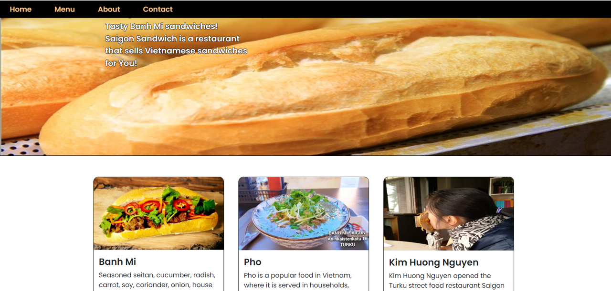

# Restaurant App

Welcome to the Restaurant App repository! This project is a practical web application designed for Saigon Sandwich Bakery, allowing users to explore menus and place orders online.

## Features

- Browse the menu offerings and make selections.
- Place orders seamlessly and conveniently.
- User-friendly interface for a smooth ordering experience.
- [Live Demo](https://kudoo39.github.io/restaurant-app)

## Installation and Usage

1. Clone the repository: `git clone https://github.com/Kudoo39/restaurant-app.git`
2. Navigate to the project directory: `cd restaurant-app`
3. Install dependencies: `npm install`
4. Run the app locally: `npm run dev`

## Technologies Used

- JavaScript
- React
- CSS
- React Bootstrap

## Project Status

The Restaurant App is currently under development. It's aimed at showcasing my skills in web development and user interface design. The project is a great opportunity to create a practical solution for restaurant customers while gaining valuable experience in building real-world applications.

## Contributing

Contributions are welcome! If you'd like to contribute, please follow the [contribution guidelines](CONTRIBUTING.md).

## License

This project is licensed under the [MIT License](LICENSE).

---

Feel free to explore the project and share your feedback. If you encounter any issues or have suggestions for improvement, please [create an issue](https://github.com/Kudoo39/restaurant-app/issues).
